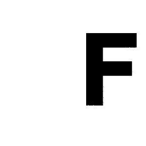
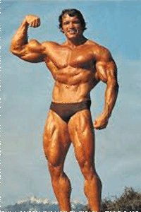

## CS5310 Computer Graphics - Beier Neely Morphing
#### Author: Da-En Yu, Time: 2025 Spring
### Overview
This project implements [Beier-Neely Morphing](https://cranehechen.com/files/beier92.pdf), a feature-based image morphing technique that smoothly transitions between two images using line pairs as control features. The technique is widely used in facial animations, special effects, and image transformations.
  
### Implementation
- `main.cpp`: Read in source and destination images, with feature lines declared as `F_src` and `F_dest` respectively.
- `image_todo.cpp`: Implementation of <b>crossDissolve</b>, <b>warp</b>, <b>BeierNeelyMorph</b>. ([reference](https://www.cs.cmu.edu/afs/andrew/scs/cs/15-463/99/pub/www/notes/warp.pdf))
- `line_segments.cpp`: Basic operations regarding line segments, e.g. perpendicular, distance, getWeight, etc.
  
### Result
- `result_F` directory: Morphing from `example_data/F.bmp` to `example_data/F_rotated.bmp`.
- `result_circleTriangle` directory: Morphing from `example_data/circle.bmp` to `example_data/triangle.bmp`.
- `result_nuo` directory: Motphing from `example_data/canuo.png` to `example_data/csnuo.png`.
  
### Showcase
- Morphing F to F_rotated: 
    
- Morphing Circle to Triangle: 

- Morphing US Arnold to China Arnold 